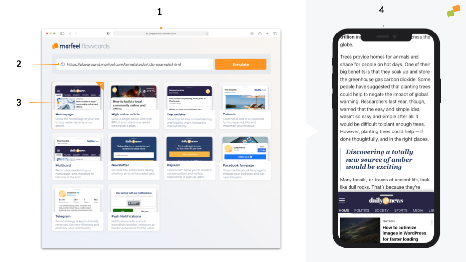

# Flowcards Playground
The [Flowcards Playground](https://playground.marfeel.com) helps users simulate a Flowcard on top of any specified url. The system has two main goals:
    - Create a touch & play environment that works on real devices to experience the smoothness of the Flowcards user experience:  pull up and down gestures, infinite scroll, hero elements, multi card system, etc.
    - Create a frictionless experimentation development environment aimed at low-code users, growth hackers and developers that want to create and test flows on the fly through the JSON and JS APIs.

# Sample simulations

Steps to run a simulation:
1. Browse to https://playground.marfeel.com
2. Introduce a URL where you want to load a Flowcard in
3. Choose one of the sample pre-defined Flowcards
4. Experience it in your smartphone or browser Dev Tools
    
## Considerations
The Flowcards SDK relies on mobile touch events that are not smooth on Desktop. For an optimum user experience you must run the simulations in an smartphone.

The Flowcards Playground loads Flowcards in the specified URL using a reverse proxy just for the purpose of testing. There might situations where loading a site through the reverse proxy doesn't work  as expected and get CORS errors or any other random error.
 
## Custom simulations
The Flowcards Playground allows simulating any `flowcards.json` you have on top of any url. To do so you have to invoke the `https://playground.mrf.io/simulate` API end point directly with the required query params:

- `siteUrl`: URL of the site you want to load a Flowcard in
- `experienceUrl`:  URL of a valid `flowcards.json` 
- `technology`:  AMP or WEB. The Flowcard will be loaded in the AMP version of the siteURL

Here are some example urls:
- [Homepage loading in Vanitatis](https://playground.mrf.io/simulate?siteUrl=https%3A%2F%2Fblogs.vanitatis.elconfidencial.com%2Fcasas-reales%2Freina-letizia%2F2021-03-05%2Fletizia-elegancia-blanco-negro-falda-meghan-markle_2978972%2F&requestHostname=playground.marfeel.com&cardType=web&experienceUrl=https://flowcards.mrf.io/json/web?site_id=154%26canonical_url=https%3A%2F%2Fblogs.vanitatis.elconfidencial.com%2Fcasas-reales%2Freina-letizia%2F2021-03-05%2Fletizia-elegancia-blanco-negro-falda-meghan-markle_2978972%2F)
- [Homepage loading in TyC](https://playground.mrf.io/simulate?siteUrl=https%3A%2F%2Fwww.tycsports.com%2Friver-plate%2Friver-plate-leonardo-ponzio-15-titulos-el-segundo-mas-ganador-de-la-historia-id325297.html&requestHostname=playground.marfeel.com&cardType=web&experienceUrl=https://flowcards.mrf.io/json/web?site_id=146%26canonical_url=https://www.tycsports.com)

## Open Source
All the configuration files of the sample flows are hosted on the [Flowcards-Playground open Github repository](https://github.com/Marfeel/flowcards-playground) to work as a reference and show the art-of-the-possible of Flowcards. 

## Codesandbox
For easy experimentation [the Flowcards-Playground Github repository](https://github.com/Marfeel/flowcards-playground) is [connected to CodeSandbox](https://codesandbox.io/s/flowcards-playground-g3geg), which allows users to do live code changes and see the results immediately without setting up a local environment. 
